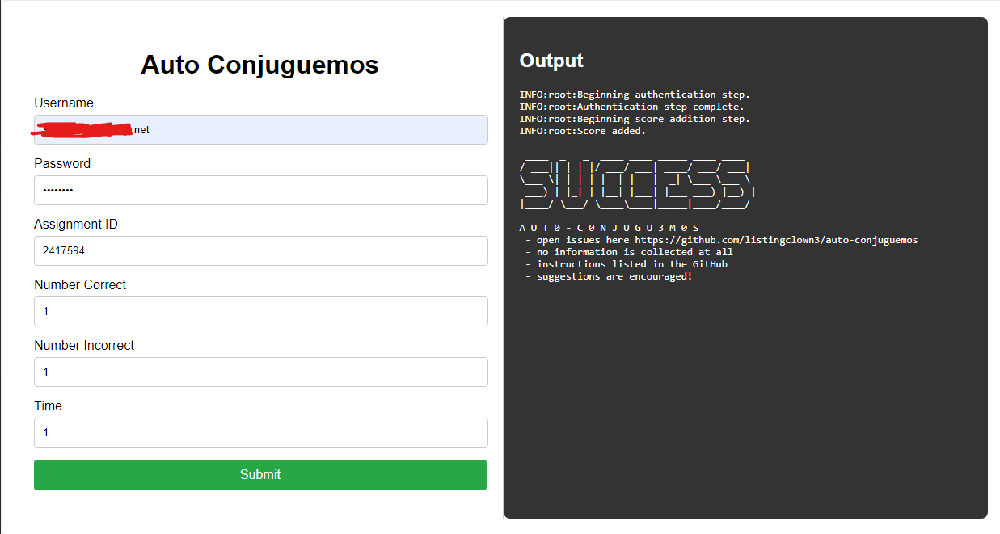

# auto-conjuguemos

Courtesy of [a2435191](https://github.com/a2435191) for providing the basis of the script. This is an extension of the public script to make it more user-friendly.

# conjuguemos account
- log into your conjuguemos account
- go to https://conjuguemos.com/student/account_info/
- create a new password
- remember your username and password
  
if you created a conjuguemos account through the native login page, you can ignore the above

# build and use
- Download code
- Open in a development envrionment, VSCode, etc.
- Make sure to have npm (node package manager) installed
- run 'npm run start'
- open on forwarded port : localhost, etc.
- follow instructions

# miscellaneous
- may break if conjuguemos backend changes
- kinda only works for homework, but can be tweaked by interfacing with cli.py directly
- might be hosted by me, but only if i don't get ddos'ed into oblivion
- might make a google chrome extension instead so that it can be run locally

# more more stuff !!!
- contribute to this repo if you can
- suggestions are always encouraged
- open issues if needed

# example

# tags !!!
- conjuguemos automater
- conjuguemos bot
- conjuguemos homework automater

# website
[test website](http://152.67.232.156:6969/conjuguemos)

this is a testing website or a production environment, but will be kept on for people who do not want to self host

it should be noted that if attacks are sent, I will consider taking down the site permanently, but I may install tighter security. 

in any case, enjoy the free production website, it runs identical code (which hopefully won't be my downfall) and stores ZERO user data, cheers!

